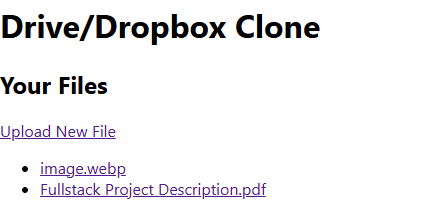

## 🛠️ Instructions

Create the database and bucket in AWS S3 console
add .env files for backend and my-app

```
cd ./backend
Run `npm install`
Run `npm run dev`
Open `http://localhost:5000`

cd ./my-app
Run `npm install`
Run `npm start`
Open `http://localhost:3000`
```

## 🛠️ API's

| Layer                       |
| --------------------------- |
| get(/) : get list of Files  |
| post(/upload) : upload file |
| get(/:id) : download file   |

## 🛠️ Tech Stack

| Layer    | Technology                   |
| -------- | ---------------------------- |
| Frontend | React + Axios + React Router |
| Backend  | Node.js + Express            |
| Database | MongoDB (Mongoose)           |
| Storage  | AWS S3                       |

/backend/.env

```
PORT=5000
MONGO_URI=mongodb://localhost:27017/dropbox-clone
AWS_ACCESS_KEY_ID=your_aws_key
AWS_SECRET_ACCESS_KEY=your_aws_secret
AWS_REGION=your_region (e.g. ap-south-1)
AWS_S3_BUCKET=your_bucket_name
```

/my-app/.env

```
REACT_APP_API_BASE=http://localhost:5000
```

Visuals:


